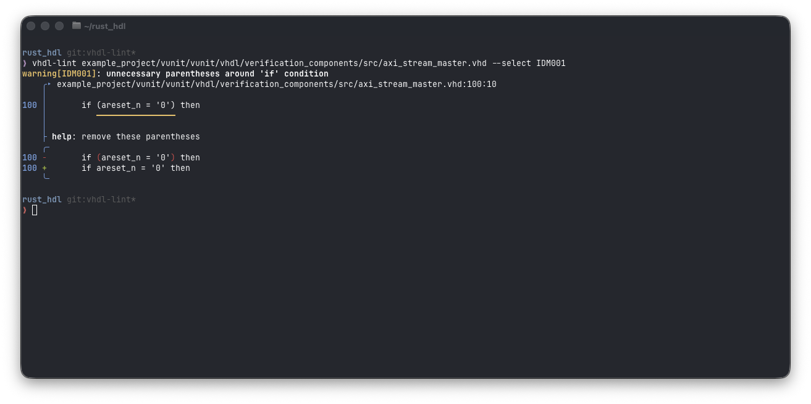

# VHDL-Lint

VHDL-Lint is a modern linter for VHDL that takes inspiration from popular linters like [ruff](https://docs.astral.sh/ruff/), [clippy](https://doc.rust-lang.org/clippy/) and [ESLint](https://eslint.org).

## Usage

VHDL-Lint can be used as a command-line tool and as a Rust library.

### As a command-line tool

```text
$ vhdl-lint --help
A modern, configurable linter for VHDL

Usage: vhdl-lint [OPTIONS] [FILES]...

Arguments:
  [FILES]...  Files or directories to check [default: .]

Options:
      --fix      Apply fixes to resolve lint violations
  -h, --help     Print help
  -V, --version  Print version

File selection:
      --exclude <FILE PATTERN>  Patterns to exclude from analysis
      --no-respect-gitignore    Disable respecting file exclusions via `.gitignore` and other standard ignore files

Rule selection:
      --select <RULE>  Comma-separated list of rules to select
      --ignore <RULE>  Comma-separated list of rules to disable

Miscellaneous:
  -e, --exit-zero  Exit with status code "0", even upon detecting lint violations
```

#### Sample output



### As a library

vhdl-lint is currently unpublished. Information on how to use it as a library will follow once it is published.

<!--
```shell
cargo add vhdl-lint
```
-->

## Status

> [!WARNING]
> **Early Stage**: This crate is in an early stage of development.
> Until version 1.0, all public API methods are subject to change at any time.
> Bugs are to be expected.

The feature set is minimal. Currently, this crate offers only marginal improvements over pretty-printing the diagnostics reported by its backend, the [vhdl_syntax](https://github.com/VHDL-LS/rust_hdl) library.

### Limitations

- All rules are disabled by default. Running the bare linter (i.e., without `--select <RULE>`) currently only checks for syntax errors.
- All linted files must be ASCII.
- Rule configuration files are not supported.
- Rules only have an error code, but no user-facing documentation.
- There are no machine-readable output formats, e.g., for CI.

## CLI Usage

### File selection

Select files to lint via the command line. Specifying a directory traverses that directory.
Add `--exclude` to exclude files.

By default, `vhdl-lint` respects `.gitignore` and other common ignore files.
Use `--no-respect-gitignore` to disable this feature.

**Examples**

```shell
# Lint all files under the `hdl` directory
vhdl-lint hdl/

# Lint all files, but exclude all files under hdl/vendor
vhdl-lint hdl/ --exclude hdl/vendor/

# Lint all files under hdl including files that are specified in `.gitignore`
vhdl-lint hdl/ --no-respect-gitignore
```

### Rule selection

Rules are selected using the `--select` and `--ignore` switches.

> [!NOTE]
> Syntax rules cannot be disabled.

Rules are identified via a category and an ID.
For example, `IDM` is the `idiom` category (signifying that there is a more idiomatic spelling for a VHDL construct that is in principle correct).

A selector is one of:

- `ALL`, which matches all rules,
- a category (e.g., `IDM`), which matches all rules in that category,
- an error code (e.g., `IDM001`), which matches a single rule.

More specific selectors take precedence over less specific ones (see the examples below).

**Examples**

```shell
# Select all available rules
vhdl-lint --select ALL

# Select all rules, except for the IDM001 rule
vhdl-lint --select ALL --ignore IDM001

# Select all rules except for the IDM rules, but keep IDM001 selected
vhdl-lint --select ALL --ignore IDM --select IDM001
```

### Fixes

Some lints offer automated fixes.
For example, the `IDM001` rule (unnecessary parentheses around `if` conditions) can automatically remove the parentheses.
Pass `--fix` as a CLI argument to automatically apply the fixes and write them back to the files.

**Example**

```shell
# Automatically fix all issues that offer a fix.
vhdl-lint --select ALL --fix
```
