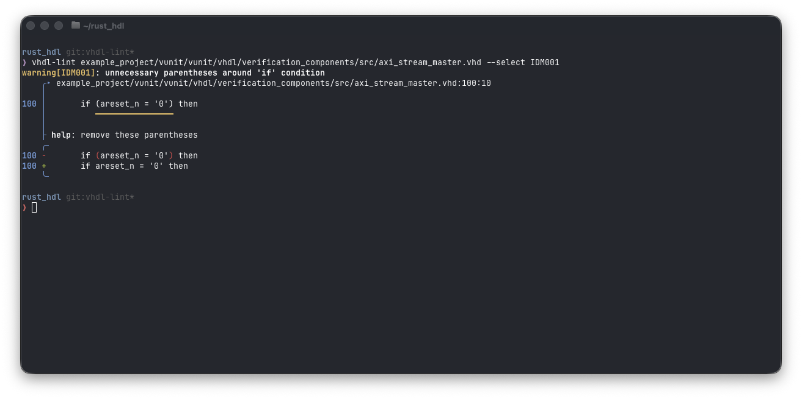

# VHDL-Lint

VHDL-Lint is a modern linter for VHDL that takes inspiration from popular linters like [ruff](https://docs.astral.sh/ruff/), [clippy](https://doc.rust-lang.org/clippy/) and [ESLint](https://eslint.org).

For more information, refer to the [documentation](https://vhdl-ls.github.io/rust_hdl/vhdl-lint/).

## Usage

VHDL-Lint can be used as a command-line tool and as a Rust library.

### Sample output



### As a library

vhdl-lint is currently unpublished. Information on how to use it as a library will follow once it is published.

<!--
```shell
cargo add vhdl-lint
```
-->

## Status

> [!WARNING]
> **Early Stage**: This crate is in an early stage of development.
> Until version 1.0, all public API methods are subject to change at any time.
> Bugs are to be expected.

The feature set is minimal. Currently, this crate offers only marginal improvements over pretty-printing the diagnostics reported by its backend, the [vhdl_syntax](https://github.com/VHDL-LS/rust_hdl) library.
